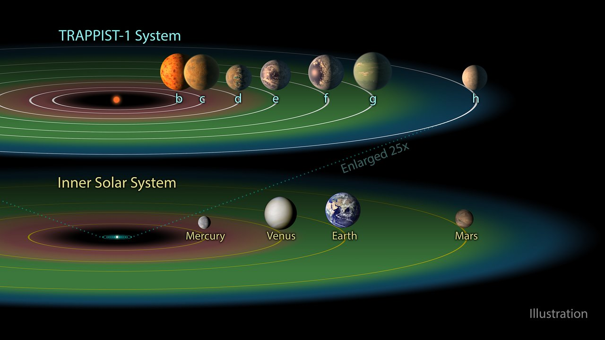
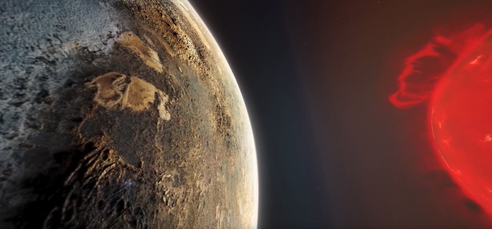

# What are exoplanets?
* Exoplanets (extrasolar planets) planets orbiting stars other than our Sun
* As of 10 Oct 2019, <b>4057</b> exoplanets are confirmed (NASA Archive)
* Most of them orbit M-dwarf stars - cooler and "redder" than the Sun

# What am I focusing on?
* Terrestrial (rocky, Earth-like) exoplanets
* Example: <b>Trappist-1</b> system, Proxima Centauri b, LHS1140b, and many more
* In particular: <b>tidally-locked</b> planets

  
  
Credit: ESA/Hubble

# What is a tidally-locked planet?

  
  
<a href="https://www.engine-house.co.uk">Engine House Animation Studio</a>

# GCM simulation of Trappist-1e

<iframe src="./view_scene.html?fileURL=./data/tsfc_cloudvol_wind_ilev20_precip__trap1e_ctrl_n96.vtkjs" width="100%" height="700px"></iframe>

# Convection on exoplanets
* <b>Hypothesis</b>: convection regulates climate on Trappist-1e
* How to test this?
* Run a global 3D GCM (UK MO Unified Model) with different convective parameterisations
* ... or switch convection scheme off and let the model deal with it

#

  <h3>Trappist-1e</h3>
  <iframe src="./view_scene.html?fileURL=./data/tsfc_trap1e_ctrl_n96.vtkjs" width="400px" height="300px"></iframe>

  <h3>Proxima b</h3>
  <iframe src="./view_scene.html?fileURL=./data/tsfc_trap1e_ctrl_n96.vtkjs" width="400px" height="300px"></iframe>

 

<iframe src="./view_scene.html?fileURL=./data/tsfc_trap1e_ctrl_n96.vtkjs" width="400px" height="300px"></iframe>

<iframe src="./view_scene.html?fileURL=./data/tsfc_trap1e_ctrl_n96.vtkjs" width="400px" height="300px"></iframe>

# So what?
* Convection in GCMs regulates the climate not only of the day side, but (even more so) of the night side
* Using a simple convection scheme can have different effects for different planets
* We can test what convection scheme is "better" by running <b>convection-resolving</b> simulations

# Global & regional simulations of Trappist-1e

<iframe src="./view_scene.html?fileURL=./data/tsfc_cloudvol_wind_ilev20_precip__trap1e_ctrl_n96.vtkjs" width="100%" height="700px"></iframe>

# Regional simulations of Trappist-1e

<iframe src="./view_scene.html?fileURL=./data/tsfc_cloudvol_wind_ilev20_precip__trap1e_ctrl_n96.vtkjs" width="100%" height="700px"></iframe>

# Work in progress
* Caveat: <b>one-way</b> nesting
* <b>How to assess the impact of high-res simulations on the global climate?</b>

Some ideas:
<ul>
<li class="fragment">Run a series global experiments with different convection schemes </li>
<li class="fragment">Integrate the vertical flux of moisture over the substellar region</li>
<li class="fragment">Calculate correlation with a night-side parameter</li>
<li class="fragment">Extrapolate for the flux calculated from the nested simulations</li>
</ul>
